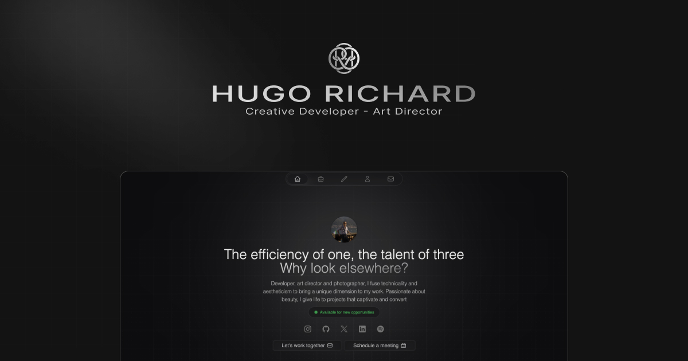

<p align="center">
    <a aria-label="Hugo's Website" href="https://hrcd.fr">
        
  <a aria-label="License" href="https://github.com/hugorcd/hr_folio_2023/blob/master/LICENSE">
    
    </a>
  <a aria-label="Follow Hugo on Twitter" href="https://twitter.com/HugoRCD__">
    
  </a>
</p>

# HR Folio

This is a fully customizable portfolio template built with [Nuxt.js](https://nuxtjs.org/) and [Tailwind CSS](https://tailwindcss.com/). Use it to showcase your work, testimonials and other information to your clients.

## Demo

You can see a live demo at [hrcd.fr](https://hrcd.fr/).

## Features

- Built-in Awesome Component & Layout
- [NuxtUI](https://ui.nuxt.com/) for some UI components
- [Tailwind CSS](https://tailwindcss.com/)
- Working contact form with [Resend](https://resend.com/)
- Article & Project Content Type using [Nuxt Content](https://content.nuxt.com/)
- [Nuxt i18n](https://i18n.nuxtjs.org/) for multi-language support
- Open Graph Image support with [Nuxt OG Image](https://nuxtseo.com/og-image/getting-started/installation)
- [Nuxt Sitemap](https://sitemap.nuxt.com/) for auto-generate sitemap.xml
- [Nuxt Robots](https://sitemap.nuxt.com/) for auto-generate robots.txt
- [ESLint](https://eslint.org/) with [Prettier](https://prettier.io/) for code linting
- Full typescript support
- Optimized images with [Nuxt Image](https://image.nuxt.com/)
- [Vue Composition Collection (Vueuse)](https://vueuse.org/)
- Fully responsive on all modern browsers
- Professional and minimal design
- Easy to customize

## Quick Setup

1. Clone this repository
```bash
git clone git@github.com:HugoRCD/hr_folio_2023.git
```

2. Install dependencies
```bash
bun install
```

3. Start development server
```bash
bun dev
```

4. Generate static project
```bash
bun generate
```

5. Start production server
```bash
bun start
```

## How to Modify the Portfolio Content

This portfolio uses [Nuxt Content](https://content.nuxt.com/) to manage the content. Here's how you can modify it:

### Articles

1. Navigate to the `content/articles` directory.
2. Here, you'll find Markdown files for each article. To modify an article, simply open its Markdown file and make your changes.
3. To add a new article, create a new Markdown file in this directory. The name of the file will be used as the URL slug for the article.

### Projects

1. Navigate to the `data/` directory.
2. Here, you'll find a `projects.ts` file. To modify the projects, simply open this file and make your changes.
3. To add a new project, add a new object to the `projects` array.

### Other Content

Simply go to the `data/` directory and do the exact same thing as above. All content works the same way.