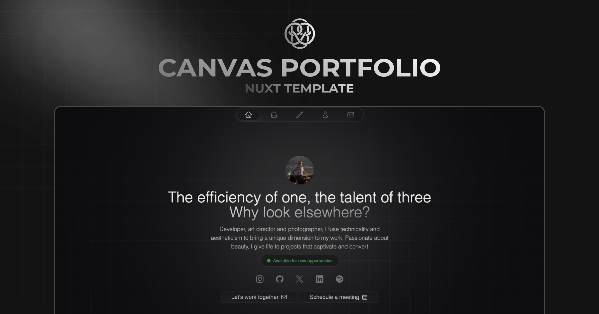

<p align="center">
    <a aria-label="Hugo's Website" href="https://hrcd.fr">
        
  <a aria-label="License" href="https://github.com/hugorcd/canvas/blob/main/LICENSE">
    
    </a>
  <a aria-label="Follow Hugo on Twitter" href="https://twitter.com/HugoRCD__">
    
  </a>
</p>

# Canvas template

Canvas Portfolio is a fully customizable i18n portfolio template built with Nuxt and Nuxt UI, designed to help you showcase your work, testimonials, and key information with ease. The template integrates with Nuxt Studio for a smooth editing experience, while leveraging Nuxt Content for content management. Built with performance, flexibility, and responsiveness in mind, Canvas Portfolio provides a robust foundation for developers and creatives alike.

## Demo

You can see a live demo at [canvas.hrcd.fr](https://canvas.hrcd.fr/).

## Features

- **Modern Components & Layouts** – Includes built-in components.
- **Nuxt UI v3** – Utilize pre-built, customizable UI components.
- **NuxtHub ready** - Deploy on NuxtHub in seconds.
- **Tailwind CSS** – A beautiful, responsive design system.
- **Working Contact Form** – Integrated with Resend for easy email handling.
- **Multi-language Support** – Powered by Nuxt i18n.
- **SEO-Ready** – Open Graph Image (Nuxt OG Image) & Nuxt Robots for automatic robots.txt generation.
- **Good practices** – Auto-generated sitemap, optimized images (Nuxt Image), and ESLint (Nuxt config with Flat config).
- **Fully Responsive** – Adapts to all modern browsers and devices.
- **Minimal & Professional Design** – Clean, elegant, and easy to customize.

## Quick Setup

1. Clone this repository if you have access or download it from the store
```bash
git clone git@github.com:HugoRCD/canvas.git
```

2. Install dependencies
```bash
pnpm install
```

3. Copy the `.env.example` file to `.env` and fill in the values
```bash
cp .env.example .env
```

4. Start development server
```bash
pnpm dev
```

5. Generate static project
```bash
pnpm generate
```

6. Start production server
```bash
pnpm start
```

## Deployments

Canvas Portfolio is designed to simplify the deployment process on various platforms, whether serverless or not. Below are several detailed methods to deploy your portfolio.

### 1. Serverless Platforms (Vercel, Netlify, etc.)

When using serverless platforms, it's important to note that Nuxt Content v3 relies by default on SQLite for content storage. Since these platforms do not support SQLite natively, we recommend connecting Canvas Portfolio to an external database such as:

-  **PostgreSQL**
-  **Turso**
-  **D1**

For further details on this process and the suitable solutions for serverless deployments, refer to the official Nuxt Content documentation:  
[Nuxt Content and Serverless Deployment](https://content.nuxt.com/docs/deploy/serverless)

#### Vercel deployment do not need any extra configuration.

[](https://vercel.com/new/clone?repository-url=https%3A%2F%2Fgithub.com%2FHugoRCD%2Fcanvas&env=NUXT_PRIVATE_RESEND_API_KEY,NUXT_PUBLIC_SITE_URL&envDescription=You%20will%20require%20an%20API%20key%20for%20Resend%20and%20Nuxt%20Studio%2C%20but%20it%20is%20not%20essential%20for%20the%20portfolio%20to%20work.%20Simply%20add%20%22test%2C%22%20for%20example%2C%20and%20edit%20the%20variable%20later.&project-name=canvas-portfolio&repository-name=canvas-portfolio&demo-title=Canvas&demo-url=canvas.hrcd.fr&demo-image=https%3A%2F%2Fcanvas.hrcd.fr%2Fog.png)

---

### 2. Deployment on Nuxthub

Nuxthub offers a powerful solution to deploy your portfolio in just a few clicks. With fast global delivery through the Cloudflare network, Nuxthub also provides advanced features such as:

-  KV storage for optimized data management
-  High-performance caching to reduce loading times
-  Integration of AI tools and analytics for performance improvements

Check out the [official Nuxthub documentation](https://hub.nuxt.com/docs/getting-started/installation#add-to-a-nuxt-project) for more info.

NuxtHub deployment do not need any extra configuration.

[](https://hub.nuxt.com/new?repo=HugoRCD/canvas-nuxthub)

---

### 3. Deployment via Docker

Canvas Portfolio is also available as a Docker image, making it easy to deploy in containerized environments. An official Docker image is automatically created using a GitHub workflow whenever a new release is made, or it can be triggered manually. 

This workflow not only builds the official Canvas image but also provides a standard way for anyone who forks the project to create their own Docker image with a proper version tag (e.g., v2.0, v1.0.0, etc.).

**To pull the latest Docker image:**

```bash
docker pull ghcr.io/hugorcd/canvas:latest
```

You can also use Docker Compose for a quick deployment. A community-provided [docker-compose.community.yml](docker-compose.community.yml) file is available and can be used with platforms like Coolify for one-click deployments.

## How to Modify the Portfolio Content

This portfolio uses [Nuxt Content](https://content.nuxt.com/) to manage the content. Here's how you can modify it:

First check the `app.config.ts` file to change the global configuration of the portfolio, there is a lot of stuff you can change here.

### Writing

1. Navigate to the `content/2.articles` directory.
2. Here, you'll find Markdown files for each article. To modify an article, simply open its Markdown file and make your changes.
3. To add a new article, create a new Markdown file in this directory. The name of the file will be used as the URL slug for the article.

### Works

1. Navigate to the `content/1.works/` directory.
2. Here, you'll find Markdown files for each article. To modify an article, simply open its Markdown file and make your changes.
3. To add a new project, add a new JSON file in this directory.

#### Featured Works

To change the featured works on the homepage, simply add the `"featured": true` key the JSON file.

### Other Content

Simply go to the `content/` directory and edit any of the Markdown or JSON files to modify the content.

## Setup the Contact Form

This portfolio uses [Resend](https://resend.com/) to handle the contact form, but it's not mandatory. The server handle will not be used if you don't set the `NUXT_PRIVATE_RESEND_API_KEY` environment variable.

To set it up, follow these steps:
- Get your api key from [Resend](https://resend.com/) here [your api key](https://resend.com/api-keys)
- Add your api key in the `.env` file
- change the `from` key in the `sendEmail` route in the `server/api/` folder, you can customize everything you want in this route
- That's it, you're good to go!

<!-- automd:fetch url="gh:hugorcd/markdown/main/src/contributions.md" -->

## Contributing
To start contributing, you can follow these steps:

1. First raise an issue to discuss the changes you would like to make.
2. Fork the repository.
3. Create a branch using conventional commits and the issue number as the branch name. For example, `feat/123` or `fix/456`.
4. Make changes following the local development steps.
5. Commit your changes following the [Conventional Commits](https://www.conventionalcommits.org/en/v1.0.0/) specification.
6. If your changes affect the code, run tests using `bun run test`.
7. Create a pull request following the [Pull Request Template](https://github.com/HugoRCD/markdown/blob/main/src/pull_request_template.md).
   - To be merged, the pull request must pass the tests/workflow and have at least one approval.
   - If your changes affect the documentation, make sure to update it.
   - If your changes affect the code, make sure to update the tests.
8. Wait for the maintainers to review your pull request.
9. Once approved, the pull request will be merged in the next release !

<!-- /automd -->

<!-- automd:fetch url="gh:hugorcd/markdown/main/src/local_development_dev.md" -->

<details>
  <summary>Local development</summary>

- Clone this repository
- Install latest LTS version of [Node.js](https://nodejs.org/en/)
- Enable [Corepack](https://github.com/nodejs/corepack) using `corepack enable`
- Install dependencies using `bun install`
- Start development server using `bun dev`
- Open [http://localhost:3000](http://localhost:3000) in your browser

</details>

<!-- /automd -->

<!-- automd:fetch url="gh:hugorcd/markdown/main/src/sponsors.md" -->

## Sponsors

<p align="center">
  <a href="https://cdn.jsdelivr.net/gh/hugorcd/static/sponsors.svg">
    
  </a>
</p>

<!-- /automd -->

## Community

<!-- automd:contributors license=Apache author=HugoRCD github="hugorcd/canvas" -->

Published under the [APACHE](https://github.com/hugorcd/canvas/blob/main/LICENSE) license.
Made by [@HugoRCD](https://github.com/HugoRCD) and [community](https://github.com/hugorcd/canvas/graphs/contributors) 💛
<br><br>
<a href="https://github.com/hugorcd/canvas/graphs/contributors">

</a>

<!-- /automd -->

<!-- automd:with-automd lastUpdate -->

---

_🤖 auto updated with [automd](https://automd.unjs.io) (last updated: Mon Feb 10 2025)_

<!-- /automd -->
